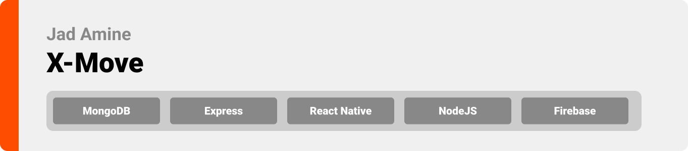
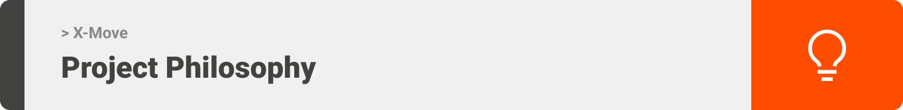
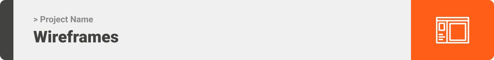

Hello world! This is the project’s summary that describes the project plain and simple, limited to the space available.

PROJECT PHILOSOPHY • WIREFRAMES • TECH STACK • IMPLEMENTATION • HOW TO RUN?

X-Move is about building the most engaged X-treme Sports Community by connecting athletes to activitiy partners, playgrounds and sports equipment renting stores. It consist of three types of users: Players use a mobile app, Owners use a web app and Admins use a desktop app

User Stories

As a user, I want to easily search for sports enthousiaste subscribed to specific sports categories

As a user, I want to easily locate players, fields & equipment renting stores based on their location on the map

As a user, I want to live chat with other players to agree on games/activities schedules

As a user, I want to easily check for fields and equipment renting prices/availabity on a dynamic calendar

As a user, I want to add friends, add posts, view friends feeds/posts and add likes and comments

Owners Stories

As an owner, I want a fully-fledged calendar to manage my reservations

As an owner, I want to be able to update my rental prices and property information

Admin Stories

As an admin, I want to be able to check my application statstics and lifecycle by interacting with a compelling a compelling dashboard showing the application data analysis visualization

As an admin, I want to be able to manage players, fields and equipment renting stores

This design was planned before on paper, then moved to Figma app for the fine details.

Here's a brief high-level overview of the tech stack used to build X-Move:

This project uses the React Native Framework. React Native is a framework used for building cross-platform native mobile apps. It can be used to develop applications that target anything from Android, iOS devices to Windows systems.

For reliability and flexibility, the app uses MongoDB database with a firm structure to allow scalability.

Here is the implementation of the application

This is an example of how you may give instructions on setting up your project locally. To get a local copy up and running follow these simple example steps.

Prerequisites
This is an example of how to list things you need to use the software and how to install them.

npm
npm install npm@latest -g
Installation
Below is an example of how you can instruct your audience on installing and setting up your app. This template doesn't rely on any external dependencies or services.

Get a free API Key at https://example.com
Clone the repo
git clone https://github.com/your_username_/Project-Name.git
Install NPM packages
npm install
Enter your API in config.js
const API_KEY = 'ENTER YOUR API';
