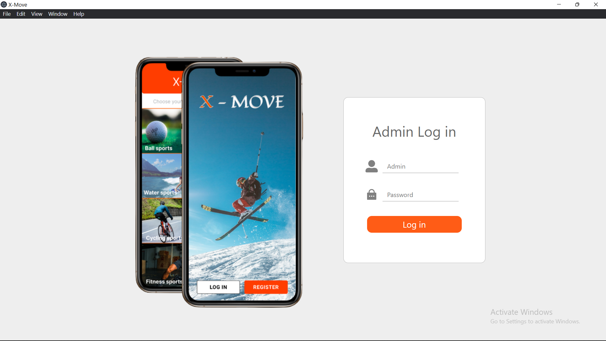
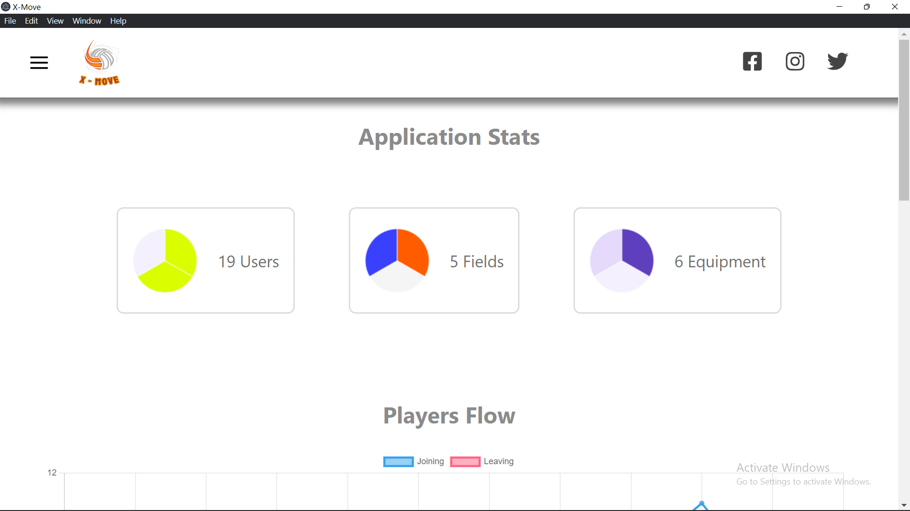

<div align="center">

> Hello world! This is the project’s summary that describes the project plain and simple, limited to the space available.

**[PROJECT PHILOSOPHY](#philosophy) • [WIREFRAMES](#wireframes) • [TECH STACK](#stack) • [IMPLEMENTATION](#implementation) • [HOW TO RUN?](#run)**

</div>

<br><br>


> X-Move is not about building a company but a community, the most engaged X-treme Sports Community by connecting athletes to activitiy partners and owners of playgrounds and sports equipments renting stores. It consist of three types of users: Players use a mobile app, Owners use a web app and Admins use a desktop app.

### User Stories

- As a user, I want to easily search for sports enthousiaste subscribed to specific sports categories.

- As a user, I want to easily locate players, fields & equipment renting stores based on their location on the map.

- As a user, I want to live chat with other players to agree on games/activities schedules.

- As a user, I want to easily check for fields and equipment renting prices/availabity on a dynamic calendar.

- As a user, I want to add friends, add posts, view friends feeds/posts and add likes and comments.

### Owner Stories

- As an owner, I want a fully-fledged calendar to manage my reservations.

- As an owner, I want to be able to update my rental prices and property information.

### Admin Stories

- As an admin, I want to be able to check my application statstics and lifecycle by interacting with a compelling dashboard showing the application data analysis visualizations.

- As an admin, I want to be able to manage players, fields and equipment renting stores.

<br><br>


<br><br>
> This design was planned before on paper, then moved to Figma app for the fine details.
<br><br>

| Landing Page                                                    | Resgister                                                        | Categories                                                         |
| --------------------------------------------------------------- | ---------------------------------------------------------------- | ------------------------------------------------------------------ |
|  |  |  |

| Players                                                         | Player Profile                                                  | Feeds                                                         |
| --------------------------------------------------------------- | --------------------------------------------------------------- | ------------------------------------------------------------- |
|  |  |  |

<br><br>


Here's a brief high-level overview of the tech stack the Well app uses:

- This project uses the [React Native ](https://reactnative.dev/)app development framework. React Native is a cross-platform hybrid app development platform which allows us to use a single codebase for running apps on Android and iOS.
- For the owners web application I used [React ](https://reactnative.dev/)a JavaScript library for building user interfaces
- For the admin desktop application I used [Electron ](https://www.electronjs.org/). Electron help us build cross-platform desktop apps that runs on any OS.
- For implementing a live chatting system is used [Firebase](https://firebase.google.com/). Firebase is an app development platform that helps you build and grow apps backed by Google
- This project rely on [Node.js](https://nodejs.org/) a JavaScript runtime built on Chrome's V8 JavaScript engine as a backend infrastructure and [Express](https://expressjs.com/) framework which is a minimal and flexible Node.js web application framework that provides a robust set of features for web and mobile applications.
- For persistent storage (database), the app uses [MongoDB](https://www.mongodb.com/). MongoDB is a document database providing scalability and flexibility whilst provisioning the querying and indexing needed for this type of social apps.

<br><br>


> Uing the above mentioned tech stacks and the wireframes build with figma from the user stories we have, the implementation of the app is shown as below, these are screenshots from the real app

<h1>Players Mobile App</h1>
<hr>

| Landing Page                                                     | Login                                                          | Choosing a partner                                            |
| ---------------------------------------------------------------- | -------------------------------------------------------------- | ------------------------------------------------------------- |
|  |  |  |

<br><br>

<h2>Find activity partners</h2>

| Categories                                                         | Ball Sports                                                     | Water Sports                                                         |
| ------------------------------------------------------------------ | --------------------------------------------------------------- | -------------------------------------------------------------------- |
|  |  |  |

<br><br>

| Cycling Sports                                                   | Categories                                                     | Fitness Sports                                                         |
| ---------------------------------------------------------------- | -------------------------------------------------------------- | ---------------------------------------------------------------------- |
|  |  |  |

<br><br>

| Winter Sports                                                         | Entertainments                                                         | Players                                                          |
| --------------------------------------------------------------------- | ---------------------------------------------------------------------- | ---------------------------------------------------------------- |
|  |  |  |

<br><br>

<h2>Search the map for players and properties for rent</h2>

| Map                                                          | Search Modal                                                       | Search Players                                                  |
| ------------------------------------------------------------ | ------------------------------------------------------------------ | --------------------------------------------------------------- |
|  |  |  |

| Search Properties for rent                                         |
| ------------------------------------------------------------------ |
|  |

<br><br>

<h2>Search properties by category and check live calendar for availability</h2>

| Search Fields for rent                                               | Search Equipments for rent                                           | Rent Properties                                                  |
| -------------------------------------------------------------------- | -------------------------------------------------------------------- | ---------------------------------------------------------------- |
|  |  |  |

| Check property availability                                       |
| ----------------------------------------------------------------- |
|  |

<br><br>

<h2>Live chatting system</h2>

| Live Messaging                                                             | Chat                                                                   | Friends Messaging                                                                 |
| -------------------------------------------------------------------------- | ---------------------------------------------------------------------- | --------------------------------------------------------------------------------- |
|  |  |  |

| Direct Messaging                                                                   |
| ---------------------------------------------------------------------------------- |
|  |

<br><br>

<h2>Friends feeds/posts</h2>

| Drawer Navigation                                               | Feeds                                                                   | Friends Posts                                                           |
| --------------------------------------------------------------- | ----------------------------------------------------------------------- | ----------------------------------------------------------------------- |
|  |  |  |

| Add Posts                                                              | Post                                                           |
| ---------------------------------------------------------------------- | -------------------------------------------------------------- |
|  |  |

<br><br>

<h2>Adding favorite sports so other players can find me</h2>

| Favorite Sports                                                                       | Add Favorite Sports                                                                    |
| ------------------------------------------------------------------------------------- | -------------------------------------------------------------------------------------- |
|  |  |

<br><br>

<h2>Managing Profile Info / Location / Friend Requests</h2>

| Profile                                                          | Add Friends                                                                   |
| ---------------------------------------------------------------- | ----------------------------------------------------------------------------- |
|  |  |

<br><br>

<h1>Owners Web App</h1>
<hr>

| <h2>Landing page</h2>        |
| ---------------------------- |
|  |

<br>

| <h2>Login</h2>              |
| --------------------------- |
|  |

<br>

| <h2>Fully fledged calendar</h2> |
| ------------------------------- |
|     |

<br>

| <h2>Dynamic reservations</h2>           |
| --------------------------------------- |
|  |

<br>

| Adding Reservation for multiple days |
| ------------------------------------ |
|         |

<br>

| <h2>Change Property info</h2> |
| ----------------------------- |
|   |

<br><br>

<h1>Admin Desktop App</h1>

| <h2>Landing Window</h2>          |
| -------------------------------- |
|  |

<br>

| <h2>Application Lifecycle / Statistics Dashboard</h2> |
| ----------------------------------------------------- |
|                          |

<br>
<h2>Data analysis</h2>
<hr>

| <h2>Players Joining/Leaving the app per month</h2> |
| -------------------------------------------------- |
|                 |

<br>

| <h2>Reservations per month for fields & equipments</h2> |
| ------------------------------------------------------- |
|                     |

<br>

<hr>


<hr>

<br>

| <h2>Players</h2>                 |
| -------------------------------- |
|  |

<br>

| <h2>Fields</h2>                 |
| ------------------------------- |
|  |

<br>

| <h2>Equipment</h2>                 |
| ---------------------------------- |
|  |

<br> <br>


> This is an example of how you may give instructions on setting up your project locally.
> To get a local copy up and running follow these simple example steps.

### Prerequisites

To run this project, you will need the following installed on your system:

- Git
- Node.js & npm
- Android Studio (for mobile emulator testing)
- MongoDB compass (or MongoDB Atlas for the online hosted service)

### Installation

1. Clone this repository

```sh
git clone https://github.com/jad-amine/X-Move.git
```

2. Navigate into the Desktop application folder named

```diff
- text in red
```

[X-Move-electron]() , to install npm packages:

```sh
cd X-Move-electron
npm install
```

3. Navigate into the Web application folder named [X-Move-react]() , to install npm packages:

```sh
cd X-Move-react
npm install
```

4. Navigate into the Mobile application folder named []X-Move-reactnative</span> , to install npm packages:

```sh
cd X-Move-reactnative
npm install
```

5. Navigate into the node.js server folder named [X-Move-server] , to install npm packages:

```sh
cd X-Move-server
npm install
```

6. Replace the DB connection string in the server .env file with the one generated by your local or hosted MongoDB instance

7. Create a Google Firebase account for free, add a new project and initiate a [Firestore] instance. Get the project credentials and navigate into x-move-reactnative folder and replace Firebase API key and credentials in the directory .env file with the ones provided by Firebase

8. In the frontend folders (Electron, React, ReactNative) you will find an api.js file holding the baseURL containing the IPv4 address of the server for sending http requests. Check your device [IPv4] local address and change accordingly. Then navigate to x-move-server/app.js and add that address as shown below:

```sh
app.listen(process.env.PORT, "your_device_IPv4", () => ...)
```

7. To run the server, navigate to the X-Move-server folder then run:

```sh
nodemon
```

8. To launch the mobile application on an emulator, make sure you have downloaded one Android Studio Andoid AVG and started it. Then navigate to the []"Client"</span> folder then run:

```sh
npm start
```

9. If you don't have access to the test DB exported data, you will need to register and upload your own data from scratch
