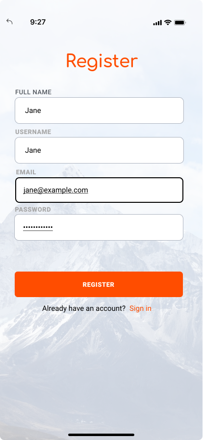

<div align="center">

> Hello world! This is the project’s summary that describes the project plain and simple, limited to the space available.

**[PROJECT PHILOSOPHY](#philosophy) • [WIREFRAMES](#wireframes) • [TECH STACK](#stack) • [IMPLEMENTATION](#implementation) • [HOW TO RUN?](#run)**

</div>

<br><br>


> X-Move is about building the most engaged X-treme Sports Community by connecting athletes to activitiy partners and owners of playgrounds and sports equipment renting stores. It consist of three types of users: Players use a mobile app, Owners use a web app and Admins use a desktop app.

### User Stories

- As a user, I want to easily search for sports enthousiaste subscribed to specific sports categories.

- As a user, I want to easily locate players, fields & equipment renting stores based on their location on the map.

- As a user, I want to live chat with other players to agree on games/activities schedules.

- As a user, I want to easily check for fields and equipment renting prices/availabity on a dynamic calendar.

- As a user, I want to add friends, add posts, view friends feeds/posts and add likes and comments.

### Owner Stories

- As an owner, I want a fully-fledged calendar to manage my reservations.

- As an owner, I want to be able to update my rental prices and property information.

### Admin Stories

- As an admin, I want to be able to check my application statstics and lifecycle by interacting with a compelling dashboard showing the application data analysis visualization.

- As an admin, I want to be able to manage players, fields and equipment renting stores.

<br><br>


<br><br>
> This design was planned before on paper, then moved to Figma app for the fine details.
<br><br>

| Landing Page                  | Resgister                      | Categories                       |
| ----------------------------- | ------------------------------ | -------------------------------- |
|  |  |  |

| Players                       | Player Profile                | Feeds                       |
| ----------------------------- | ----------------------------- | --------------------------- |
|  |  |  |

<br><br>


Here's a brief high-level overview of the tech stack the Well app uses:

- This project uses the [React Native ](https://reactnative.dev/)app development framework. React Native is a cross-platform hybrid app development platform which allows us to use a single codebase for running apps on Android and iOS.
- For the owners web application I used [React ](https://reactnative.dev/)a JavaScript library for building user interfaces
- For the admin desktop application I used [Electron ](https://www.electronjs.org/). Electron help us build cross-platform desktop apps that runs on any OS.
- For implementing a live chatting system is used [Firebase](https://firebase.google.com/). Firebase is an app development platform that helps you build and grow apps backed by Google
- This project rely on [Node.js](https://nodejs.org/) a JavaScript runtime built on Chrome's V8 JavaScript engine as a backend infrastructure and [Express](https://expressjs.com/) framework which is a minimal and flexible Node.js web application framework that provides a robust set of features for web and mobile applications.
- For persistent storage (database), the app uses [MongoDB](https://www.mongodb.com/). MongoDB is a document database providing scalability and flexibility whilst provisioning the querying and indexing needed for this type of social apps.

<br><br>


> Uing the above mentioned tech stacks and the wireframes build with figma from the user stories we have, the implementation of the app is shown as below, these are screenshots from the real app

| Landing Page                                                    | Login                                                         |
| --------------------------------------------------------------- | ------------------------------------------------------------- |
| <div style="height: 500px"></div> | <div style="height: 500px"></div> |

<br><br>

| Navigation  
| ------------------------------
| <div style="height: 500px"></div>

<br><br>

| Home                                                          | Sports                                                         |
| ------------------------------------------------------------- | -------------------------------------------------------------- |
| <div style="height: 500px"></div> | <div style="height: 500px"></div> |

<br><br>

| Players                                                         | Player Profile                                                        |
| --------------------------------------------------------------- | --------------------------------------------------------------------- |
| <div style="height: 500px"></div> | <div style="height: 500px"></div> |

<br><br>
<br><br>

| Map                                                         | Fields                                                         |
| ----------------------------------------------------------- | -------------------------------------------------------------- |
| <div style="height: 500px"></div> | <div style="height: 500px"></div> |

<br><br>

| Equipment                                                         | Calendar                                                         |
| ----------------------------------------------------------------- | ---------------------------------------------------------------- |
| <div style="height: 500px"></div> | <div style="height: 500px"></div> |

<br><br>

| Chats                                                         | Profile                                                         |
| ------------------------------------------------------------- | --------------------------------------------------------------- |
| <div style="height: 500px"></div> | <div style="height: 500px"></div> |

<br><br>

| Friends                                                         | Navigation                                                     |
| --------------------------------------------------------------- | -------------------------------------------------------------- |
| <div style="height: 500px"></div> | <div style="height: 500px"></div> |

<br><br>

| Favorite Sports                                                   | Favorite Sports                                                   |
| ----------------------------------------------------------------- | ----------------------------------------------------------------- |
| <div style="height: 500px"></div> | <div style="height: 500px"></div> |

<br><br>

| Feeds                                                            | Posts                                                         |
| ---------------------------------------------------------------- | ------------------------------------------------------------- |
| <div style="height: 500px"></div> | <div style="height: 500px"></div> |

<br><br>


> This is an example of how you may give instructions on setting up your project locally.
> To get a local copy up and running follow these simple example steps.

### Prerequisites

This is an example of how to list things you need to use the software and how to install them.

- npm
  ```sh
  npm install npm@latest -g
  ```

### Installation

_Below is an example of how you can instruct your audience on installing and setting up your app. This template doesn't rely on any external dependencies or services._

1. Get a free API Key at [https://example.com](https://example.com)
2. Clone the repo
   ```sh
   git clone https://github.com/your_username_/Project-Name.git
   ```
3. Install NPM packages
   ```sh
   npm install
   ```
4. Enter your API in `config.js`
   ```js
   const API_KEY = "ENTER YOUR API";
   ```
